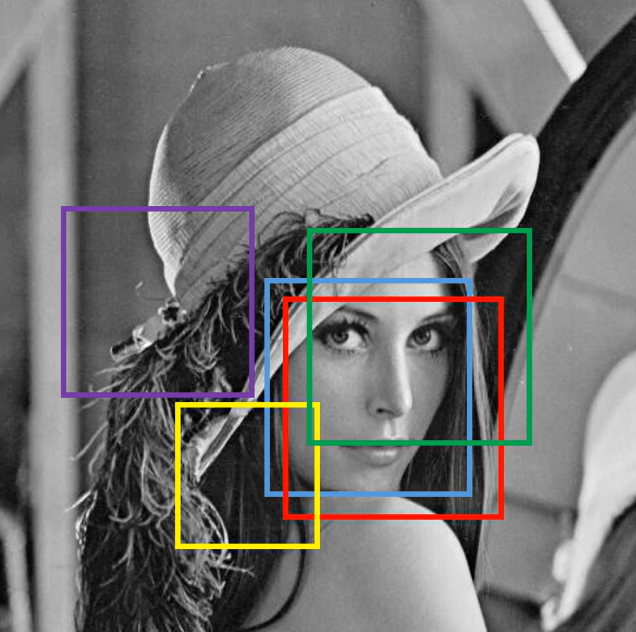
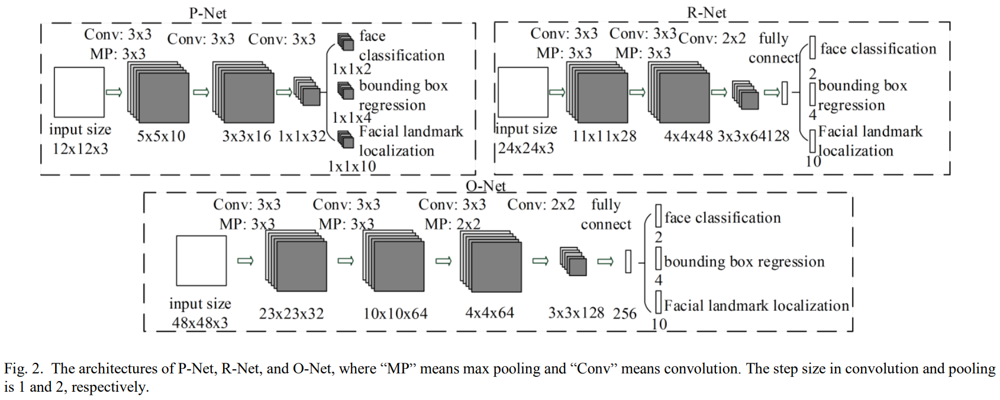
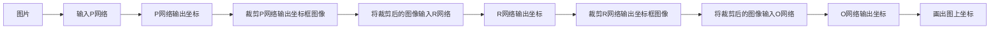

# 人脸检测模型 MTCNN
## MTCNN 的样本数据
根据三个网络的设计，分别得到三个网络输入图像的尺寸大小：
- 12 * 12
- 24 * 24
- 48 * 48

网络在学习过程中，主要学习两个参数
- 置信度，表示窗口滑动到当前位置时，检测到人脸的概率值
- 坐标偏移值，用来回归真实坐标

根据需求，模型不仅要学习是否有人脸，还要学习人脸的位置。所以我们将尺寸下的样本做了：正样本（全人脸）、部分样本（部分人脸）、负样本（非人脸）。用正样本和负样本来训练是否有人脸的置信度，用正样本和部分样本来训练人脸的坐标位置。

### 如何生成样本数据？
在原人脸框附近随机偏移、缩放人脸框，就可以得到和原人脸的 IOU 值

IOU 值可以作为置信度的标签，根据置信度的大小，可以分为三种样本（按照论文的推荐）：
- 正样本：IOU > 0.65
- 部分样本：0.4 < IOU < 0.65
- 负样本：IOU < 0.3

正样本、部分样本、负样本的比例是 1:1:3

## MTCNN 模型训练

根据样本的置信度分类 [负, 正, 部分] : [0, 1, 2]，对样本进行分类训练
1. 将类别小于 2 的正、负样本用来做置信度的训练，损失函数选择 BCE
2. 将类别大于 0 的正、部分样本用来做坐标偏移量的训练，损失函数选择 MSE

MTCNN 的 (P, R, O) 三个网路在训练中是可以并行训练的，由于三个网络的样本都是各自独立的，所以可以同时训练三个网络。

而实际使用 MTCNN 模型的时候，三个网络都是串行使用的，级联的思想也在此体现。

生成数据样本越多，模型泛化能力越强，推理能力越强，特征（遮挡）联想能力越强。

## MTCNN 的网络结构

## MTCNN 基本使用流程

## MTCNN 需要的知识模块
- 图像金字塔
  
  为了检测不同大小的人脸，MTCNN 会将输入图像按比例缩小，生成不同分辨率的图像集合，就像金字塔一样，从大到小排列。这样可以在不同尺度的图像上检测人脸，避免因人脸大小不同而漏检。
- IOU
- 图像正方形转换

  MTCNN 的网络输入通常要求是正方形图像。对于原始的非正方形人脸候选区域，需要进行正方形转换，比如通过填充或裁剪等方式，将其调整为正方形，以适应网络的输入要求。
- 级联卷积
- 图像坐标反算
- NMS（非极大值抑制）
  
  当检测出多个可能的人脸框时，这些框可能会有重叠。NMS 会保留得分最高的框，并抑制与它重叠度过高的其他框，从而去除冗余的检测结果，得到更简洁、准确的人脸检测结果。

## 目标检测如何选择建议框

建议框大小不变，图像改变